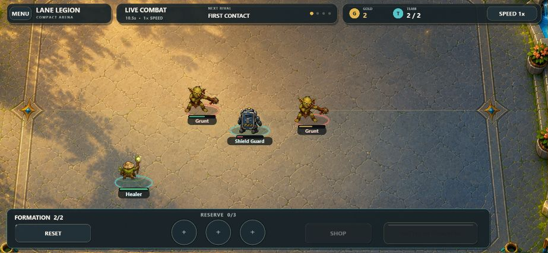
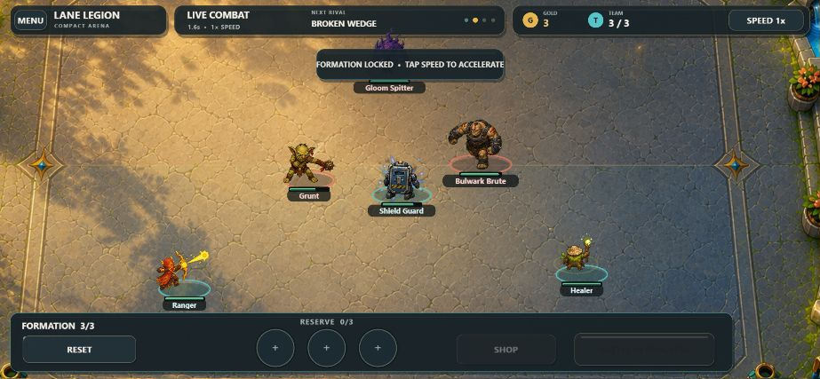
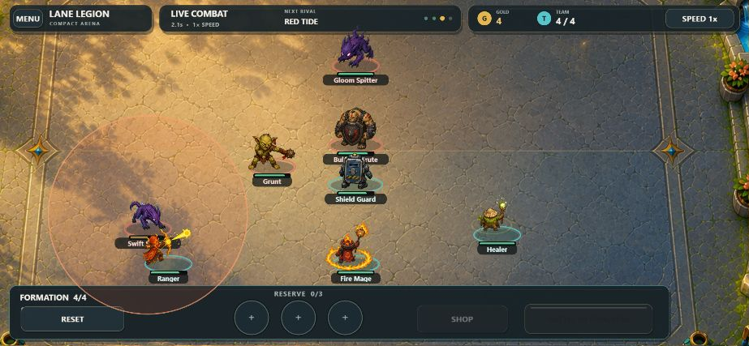
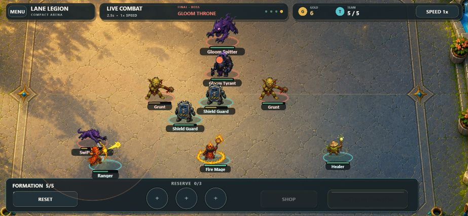

# Lane Legion

[](https://github.com/emfau88/LaneLegion/actions/workflows/deploy.yml)

Lane Legion ist ein positiver Fantasy-Autobattler für den Browser. Das Projekt enthält zwei eigenständig spielbare Varianten: das ursprüngliche Lane-Defense-Spiel und die neue, kompaktere Arena-Version. Beide laufen vollständig clientseitig mit Phaser 3, TypeScript und Vite – ohne Konto oder Backend.

## Direkt im Browser spielen

| Version | Spielidee | Mobile | GitHub Pages |
| --- | --- | --- | --- |
| **Version 1 – Lane Legion Original** | Klassisches Lane-Defense-Spiel mit 15 Wellen, vier Fraktionen, 1v1/2v2, Einheitenbau, Söldnern und King-Upgrades | Hochformat, Touch und Vollbild | **[Original spielen](https://emfau88.github.io/LaneLegion/)** |
| **Version 2 – Compact Arena (neu)** | Kurze Kampagne aus vier Formationskämpfen; Team rekrutieren, Aufstellung anpassen und den Boss besiegen | Querformat, Touch, Drehhinweis und Vollbild | **[Compact Arena spielen](https://emfau88.github.io/LaneLegion/arena.html)** |

Compact Arena ist damit ausdrücklich die **zweite, neue Version**. Sie liegt bewusst neben dem Original, besitzt einen eigenen Einstiegspunkt (`arena.html`), einen eigenen Spielzustand und ein eigenes Kampfsystem. Das Original bleibt unverändert über `index.html` erreichbar.

## Spielbeschreibung

### Version 1 – Lane Legion Original

Im Original verteidigst du deine Lane mit einer stetig wachsenden Armee. Du wählst eine von vier Fantasy-Fraktionen, stellst Einheiten auf, schickst Söldner zur gegnerischen Seite und verbesserst deinen King. Die 15 Wellen werden automatisch ausgespielt; deine Entscheidungen bei Wirtschaft, Kontern und Positionierung bestimmen den Ausgang.

### Version 2 – Compact Arena

Compact Arena konzentriert sich auf einen schnellen, gut lesbaren Ablauf:

1. Gegnerische Formation ansehen.
2. Einen Kämpfer rekrutieren und das Team von zwei auf fünf Einheiten ausbauen.
3. Tanks, Fernkämpfer, Magier und Supporter sinnvoll aufstellen.
4. Den automatischen Kampf starten, Gold verdienen und die Formation anpassen.
5. Im vierten Kampf den Gloom Throne bezwingen.

## Alle vier Compact-Arena-Level in Aktion

Die neue Version besitzt genau vier klar getrennte Begegnungen. Die Bilder zeigen jeweils einen laufenden Kampf.

### 1. First Contact

Der Einstieg erklärt Frontlinie und Fernkampf mit einer kleinen 2-gegen-2-Formation.



### 2. Broken Wedge

Ein Bulwark Brute und ein Gloom Splitter zwingen das auf drei Kämpfer gewachsene Team zu einer stabileren Formation.



### 3. Red Tide

Vier Gegner greifen aus mehreren Richtungen an; Flächenschaden und Schutz der hinteren Reihe werden wichtig.



### 4. Gloom Throne

Der finale Bosskampf nutzt das vollständige Fünferteam gegen den Gloom Tyrant und seine Eskorte.



## Mobile spielen

- **Original:** Das Spiel skaliert auf die komplette Hochformat-Fläche und verwendet große Touch-Ziele. Beim ersten Antippen wird – sofern der Browser es erlaubt – Vollbild angefordert.
- **Compact Arena:** Für die breitere Formation ist Querformat vorgesehen. Im Hochformat erscheint eine eigene Drehansicht; im Querformat füllt die Arena den verfügbaren Bildschirm ohne Scrollen.
- **iPhone/iPad:** Safari erlaubt eine erzwungene Bildschirmdrehung nicht immer. In diesem Fall das Gerät manuell drehen; das Spiel bleibt trotzdem bedienbar.
- **Android:** Aktuelle Chrome-basierte Browser unterstützen den Querformat-/Vollbild-Übergang in der Regel direkt.
- Beide Varianten benötigen keine Maus oder Tastatur. Ein Service Worker hält die Einstiegspunkte und bei weiteren Aufrufen geladene Spielressourcen im Browser-Cache.

## GitHub Pages und Deployment

Beide Versionen werden gemeinsam als statische Website veröffentlicht. Der Workflow [`.github/workflows/deploy.yml`](.github/workflows/deploy.yml) baut bei jedem Push auf `main` das Verzeichnis `dist/` und veröffentlicht es über GitHub Pages. Vites relative Basis (`base: './'`) sorgt dafür, dass Skripte, Grafiken und Sounds auch unter dem Repository-Pfad `/LaneLegion/` geladen werden.

## Lokal starten

```bash
npm install
npm run dev
```

Danach die vom Terminal ausgegebene Adresse öffnen:

- `/` für das Original
- `/arena.html` für Compact Arena

Für einen Test auf einem Smartphone im selben WLAN den Dev-Server über die lokale Netzwerkadresse aufrufen.

## Build und Tests

```bash
npm run build       # statischer Produktions-Build in dist/
npm run preview     # Produktions-Build lokal ansehen
npm run arena:sim   # deterministischer Test aller vier Arena-Kämpfe
npx -y tsx simcheck.ts  # Headless-Test des ursprünglichen Spiels
```

## Projektstruktur

- `src/model/` – reine Datenmodelle des Originalspiels
- `src/data/` – Fraktionen, Kämpfer, 15 Wellen, Söldner, Schadensmatrix und Balancing
- `src/systems/` – Simulation für Phasen, Bewegung, Kampf, Wirtschaft und KI
- `src/scenes/` – Phaser-Szenen des Originalspiels
- `src/ui/` – wiederverwendbare UI-Komponenten
- `src/arena/` – eigenständige Logik, Daten, Szenen und Simulation von Compact Arena
- `docs/design/compact-arena-p0.md` – visuelle und spielerische Zielsetzung der Arena
- `docs/compact-arena-roadmap.md` – Ausbauplan der neuen Version

## Balancing anpassen

| Bereich | Datei |
| --- | --- |
| Startgold, King-Werte, Grid und globale Regeln | `src/data/gameConfig.ts` |
| Fraktionen und passive Effekte | `src/data/factions.ts` |
| Kämpfer, Kosten, Upgrades und Auren | `src/data/fighters.ts` |
| Wellen 1–15 | `src/data/waves.ts` |
| Söldner | `src/data/mercenaries.ts` |
| Angriffs-/Rüstungsschaden | `src/data/damageMatrix.ts` |
| King-Upgrades | `src/data/kingUpgrades.ts` |
| KI-Schwierigkeitsgrade | `src/data/aiProfiles.ts` |
| Arena-Begegnungen | `src/arena/data/arenaEncounters.ts` |
